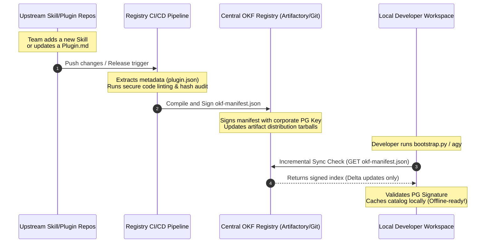

# Antigravity Dynamic Harness Configuration (DHC) Enterprise Roadmap 🗺️

This document outlines the strategic technical vision and execution plan for evolving our **Dynamic Harness Configuration (DHC)** suite into an **enterprise-ready, OKF-driven platform**. 

Our core objective is to transition from a local, file-cached setup to a highly secure, centralized registry system. By leveraging declarative **Organizational Knowledge File (OKF) Manifests**, **hierarchical layered governance**, and **secure repository pointers**, we enable offline-first, deterministic capability-matching that remains 100% compliant with strict banking air-gap constraints.

---

## 🎯 Federated, Layered Governance Model

Enterprise platforms cannot operate on flat, monolithic rule sets. A retail mobile banking app requires vastly different sandbox boundaries and APIs than an internal data analytics platform. To support this diversity, we model a **Federated, Layered OKF Stack** consisting of three distinct governance layers:

```
┌─────────────────────────────────────────────────────────────┐
│  Tier 1: Enterprise Global Baseline (SecOps / Platform Eng) │
│  - Non-negotiable security baseline, credential masking.     │
│  - Locked policies (e.g. Strict Banking command block).    │
└──────────────────────────────┬──────────────────────────────┘
                               │ (Inherited & Locked)
                               ▼
┌─────────────────────────────────────────────────────────────┐
│  Tier 2: Business Unit / Group Scope (Division Tech Leads)  │
│  - Team-specific toolkits, databases, and custom MCPs.      │
│  - Division styling rules and domain validation policies.   │
└──────────────────────────────┬──────────────────────────────┘
                               │ (Overlaid & Merged)
                               ▼
┌─────────────────────────────────────────────────────────────┐
│  Tier 3: Local Workspace Scope (Individual Project Team)    │
│  - Bespoke workspace mocks, temporary debug helpers.        │
│  - Specific version pins for local test execution.          │
└─────────────────────────────────────────────────────────────┘
```

### The Deep-Merge and Resolution Strategy

When the Harness Configurator boots in a project workspace, it resolves rules from top to bottom, applying a **Hierarchical Deep Merge**:
1. **Conflict Resolution:** `Tier 1 (Global) > Tier 2 (Group) > Tier 3 (Local)`.
2. **Immutability (Locks):** Any rule or plugin in a higher tier marked as `"enforce": "locked"` or `"enforcement": "enforced_globally"` cannot be overridden, disabled, or excluded by lower-tier manifests. The local configurator's interactive interview will grey out and lock these options as pre-selected.
3. **Additive Merging:** Lists (such as file paths in `.antigravityignore` or pre-run lint rules in `AGENTS.md`) are concatenated and deduplicated, guaranteeing that the global corporate hygiene parameters always run alongside team-specific tools.

---

## 🔄 Upstream Synchronization & Versioning Pipeline

To keep the local workspace OKF manifests dynamically aligned with rapidly evolving upstream skills, group playbooks, and team rules, we establish a **Decoupled Compile-and-Sync Lifecycle**:



### Technical Sync Mechanics:
*   **Decoupled Upstream Compilation:** Instead of developers manually copy-pasting new skills, platform CI/CD pipelines compile metadata from individual upstream repositories into a single unified `okf-manifest.json` catalog.
*   **Delta-Only Syncing:** The local harness check executes a highly optimized, light HTTPS GET (or git shallow fetch) against the corporate mirror proxy. If the signature hash matches our cached copy, the network loop is immediately terminated, keeping startup latency near zero.
*   **Strict Hash Verification:** The compiled manifest registers the SHA256 checksum of every downloadable plugin zip. During JIT promotion, the local helper script asserts that the downloaded payload exactly matches the registered hash, shielding developer environments from upstream man-in-the-middle exploits.

---

## 🎯 OKF Hierarchical Manifest Schema Blueprint (`okf-manifest.json`)

```json
{
  "$schema": "https://config.company.internal/schemas/okf-manifest-v2.json",
  "organization": "Enterprise-Platform-Engineering",
  "tier": "tier2_business_unit",
  "group_id": "wealth-management-api-team",
  "inherits_from": "https://config.company.internal/global/okf-global.json",
  "last_compiled": "2026-07-14T10:41:00Z",
  "plugins": [
    {
      "id": "strict-banking-harness",
      "version": "1.4.2",
      "enforcement": "enforced_globally",
      "locked": true,
      "triggers": {
        "files": ["requirements.txt", "package.json", "go.mod"]
      },
      "distribution": {
        "type": "artifactory",
        "pointer": "https://artifactory.company.internal/artifactory/generic/dhc-plugins/strict-banking-harness-1.4.2.tar.gz",
        "sha256": "8f3c1b72a9e0f3d5483296c7b399dcfbe201a1820bda6c39f10fbc2e1a3b110f"
      }
    },
    {
      "id": "wealth-mgmt-db-mcp",
      "version": "0.9.1",
      "enforcement": "enforced_by_group",
      "locked": false,
      "triggers": {
        "files": ["*.sql", "database.yaml"]
      },
      "distribution": {
        "type": "git",
        "pointer": "git@github.company.internal:wealth-mgmt-platform/wealth-db-mcp.git",
        "branch": "stable"
      }
    }
  ]
}
```

---

## 🗺️ Strategic Implementation Roadmap

We organize the evolution of the DHC suite into four sequential, high-impact milestones:

### Phase 1: Declarative OKF Specification & Layered Matcher (Short-Term)
*Establish the foundational parsing standard and pivot the configurator to support multi-tier manifest deep merges.*

*   **1.1 Schema Formalization:** Define and document the official hierarchical `okf-manifest.json` schema layout, including glob selectors, dependency matchers, and hash validations.
*   **1.2 Local Catalog Integration:** Bundle our existing plugins into a local catalog cached within `.agents/plugins_cache/` split by global baseline and team-specific suggestions.
*   **1.3 Deep-Merge Engine Development:** Write a lightweight Python utility (`merge-manifests.py`) to parse and merge Global, Group, and Workspace manifests, enforcing `locked: true` rules cleanly.
*   **1.4 Configurator Upgrade:** Rewrite the Harness Configurator Agent's system prompt (`agents/harness-configurator/agent.md`) to read and parse this combined manifest, making recommendations fully data-driven.

### Phase 2: Secure JIT Fetching & Distribution Engine (Mid-Term)
*Build the secure pipeline that pulls actual skills and rules into the workspace dynamically using the manifest's pointers, fully satisfying air-gapped sandbox policies.*

*   **2.1 Native Python Fetcher:** Add a secure download/clone module inside `bootstrap.py` capable of pulling Tarballs/Zips from secure enterprise Artifactories or executing shallow git clones.
*   **2.2 Whitelist & Hash Validation:** Enforce strict URL domain whitelists and assert SHA256 checksum integrity checks on all fetched plugin tarballs prior to extracting them into `.agents/plugins/`.
*   **2.3 Local Shared Caching:** Set up a system-level caching layer (e.g., `~/.gemini/antigravity/plugins_cache/`) to avoid redundant downloads across separate developer workspaces.

### Phase 3: Centralized Sync & Immutable Governance (Mid-Term)
*Implement compile-on-commit automation for upstream repos, dynamic local signature verification, and secure compliance locking.*

*   **3.1 Upstream Registry Compiler:** Develop Git actions that compile and sign unified `okf-manifest.json` indexes whenever an upstream skill or plugin repository issues a release.
*   **3.2 Signature Verification & Delta Pull:** Integrate a secure cryptographic validation check inside `bootstrap.py` to assert that fetched manifest indexes are signed with trusted corporate platform keys.
*   **3.3 Policy Telemetry Logging:** Introduce a low-privilege background audit logger that captures metadata on blocked commands (such as a blocked outbound `curl` or unapproved package install) and aggregates them for security dashboards without leaking proprietary source code.

### Phase 4: Self-Service Developer Portal & Compliance Pipelines (Long-Term)
*Scale the catalog out to the broader enterprise engineering community, making it easy for platform teams to author and validate custom rules.*

*   **4.1 Self-Service CLI Scaffolding:** Create interactive CLI utilities (e.g., `dhc-cli skill create`) that guide platform architects in bootstrapping OKF-compliant skills and rules.
*   **4.2 Automated Compliance Verification:** Write a continuous integration (CI) pipeline that spins up an isolated gVisor/Docker sandboxed environment to run ruff linting, security scanning (via `sec-auditor`), and verification tests on newly proposed plugins.
*   **4.3 Centralized Rollout Coordinator:** Support blue-green and phased rollouts of security rules (e.g., enforcing a new air-gap hook on 10% of developer workspaces first) before enforcing them company-wide.

---

## 📈 Impact Matrix & Comparison

| Feature | Phase 0 (Current Setup) | Target Phase (OKF Platform) | Enterprise Benefit |
| :--- | :--- | :--- | :--- |
| **Plugin Distribution** | Hard-copied locally in repository | Lazyloaded via remote pointers | Drastically shrinks git repo size, enables instant version upgrades. |
| **Search Mechanics** | Hardcoded logic in Agent prompt | Offline OKF manifest matching | Removes LLM hallucination, guarantees 100% accurate recommendations. |
| **Governance Structure** | Single-tier, flat config rules | Federated Global / Group / Local | Enables division heads to tailor rules without diluting global corporate security. |
| **Sync Mechanics** | Manual copying on request | Decoupled CI/CD Sync + Signature | Guarantees developers always run the latest audited security and engineering guidelines JIT. |
| **Compliance Guardrails** | Interactive, developer-selected | Immutable, locked enforcement | Prevents security bypasses, satisfies strict audit controls. |
| **Network Constraints** | Local-only or internet-dependent | Internal mirror resolution | Fully compliant with air-gapped banking network guidelines. |
